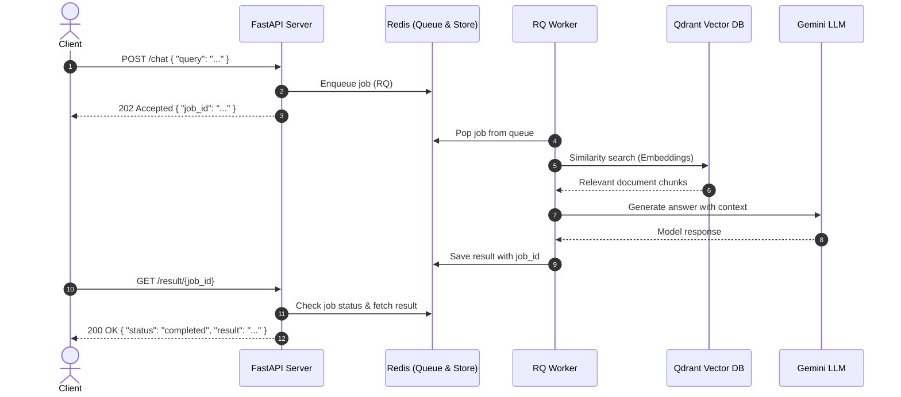

# Async RAG Pipeline Architecture

An asynchronous Retrieval-Augmented Generation (RAG) system using **FastAPI**, **Redis Queue (RQ)**, **Qdrant**, and **Gemini**.

---

## Architecture Diagram



---

## Core Components

| Component | Technology | Role |
| :--- | :--- | :--- |
| **API Server** | FastAPI | Receives queries, enqueues jobs, and exposes result-polling endpoints. |
| **Message Broker** | Redis (`:6379`) | Manages the task queue via RQ and stores job status/results. |
| **Worker** | Python RQ Worker | Dequeues tasks asynchronously, queries the vector database, and prompts the LLM. |
| **Vector DB** | Qdrant (`:6333`) | Stores document embeddings and executes semantic similarity search. |
| **LLM Engine** | Google Gemini | Generates grounded responses based on retrieved PDF context. |

---

## API Endpoints

### 1. Submit Query
- **`POST /chat`**
- **Request Body:**
  ```json
  { "message": "What is the summary of section 2?" }
  ```
- **Response (202 Accepted):**
  ```json
  { "job_id": "c1f7a2d4-89b5-4b11-a83e-90c283ef31d0", "status": "queued" }
  ```

### 2. Fetch Result
- **`GET /result/{job_id}`**
- **Response (200 OK):**
  ```json
  {
    "job_id": "c1f7a2d4-89b5-4b11-a83e-90c283ef31d0",
    "status": "finished",
    "result": "Based on page 4...",
    "error": null
  }
  ```

---

## Flow Summary

1. **Decoupled Ingestion:** API stays non-blocking and highly available by immediately acknowledging requests with a `job_id`.
2. **Background Execution:** Dedicated workers process CPU/network-intensive vector retrieval and LLM generation tasks.
3. **Result Polling:** Clients poll `/result/{job_id}` until status reaches `finished` or `failed`.